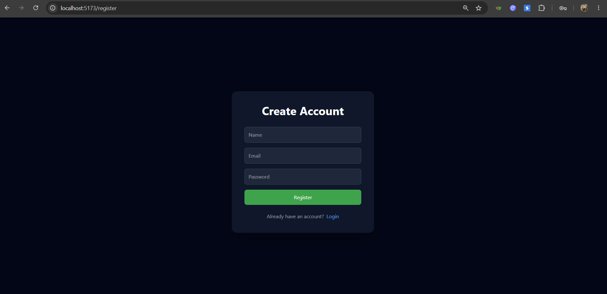
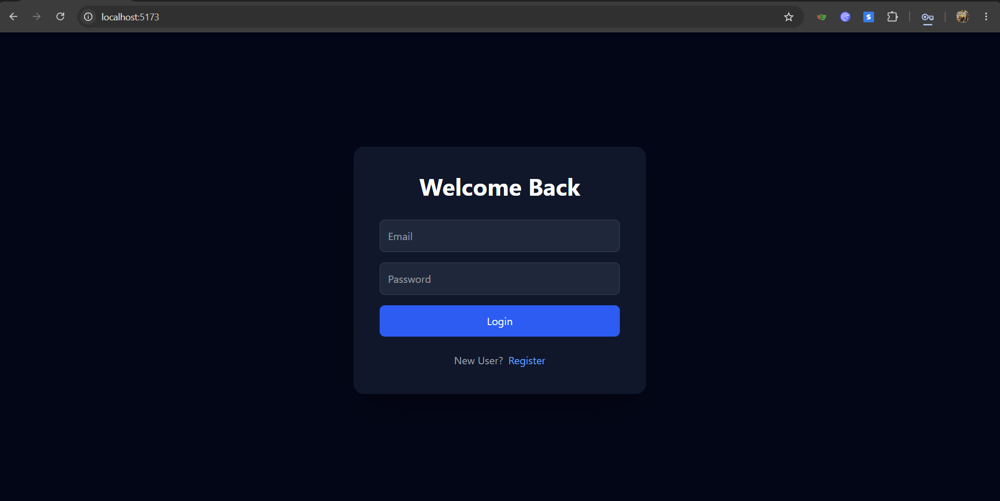
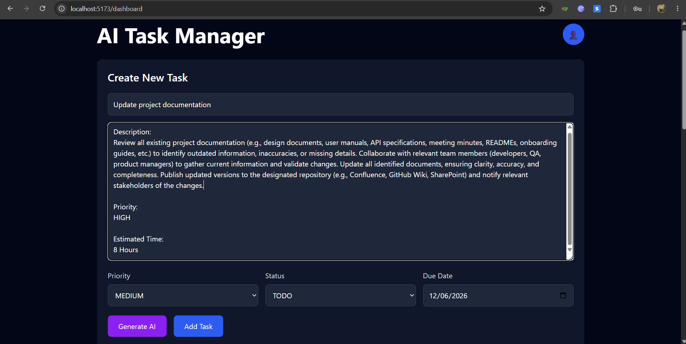
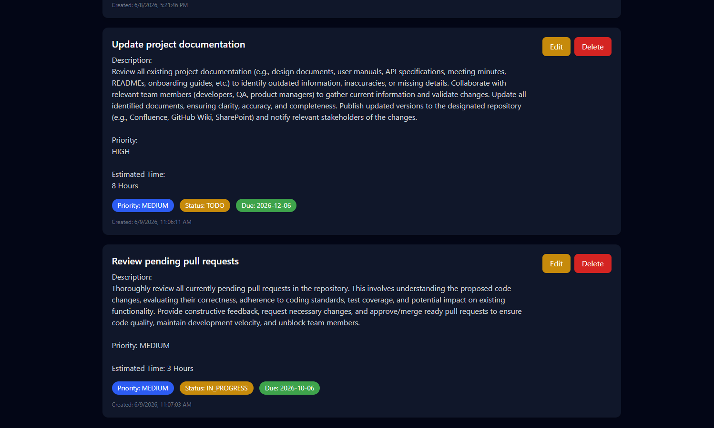
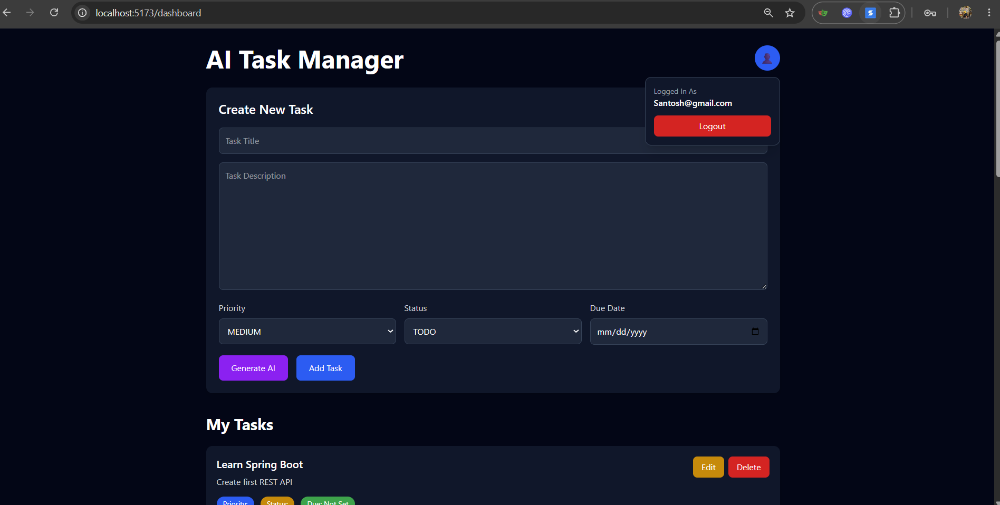
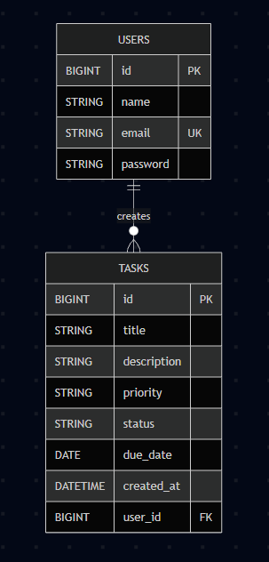
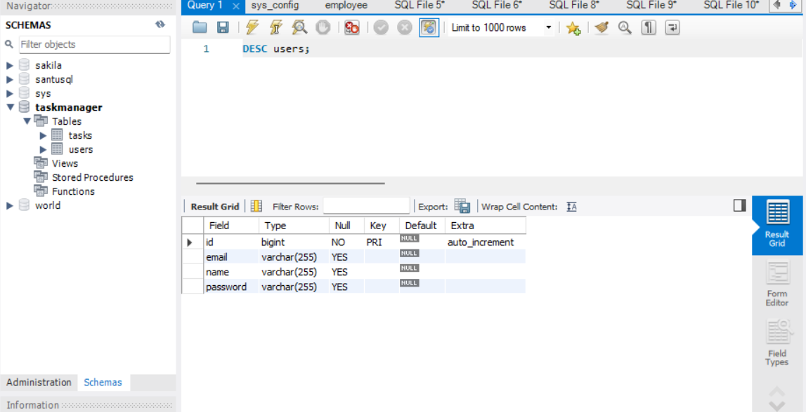
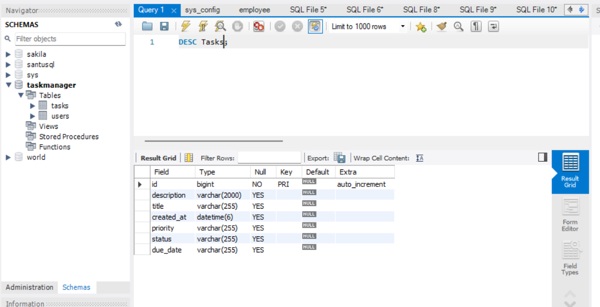

# AI-Powered Task Management Application

## Project Overview

This project is a Full-Stack AI-Powered Task Management Application developed using Spring Boot, React, MySQL, JWT Authentication, and Google Gemini AI.

The application allows users to register, log in securely, create and manage tasks, track task progress, and leverage AI to automatically generate detailed task descriptions.

The goal of the application is to improve productivity by combining traditional task management features with AI-assisted task creation.

---

# Features

## Authentication Module

- User Registration
- User Login
- JWT Token-Based Authentication
- Protected API Endpoints
- Logout Functionality

---

## Task Management Module

Users can:

- Create Tasks
- View Tasks
- Edit Tasks
- Delete Tasks
- Track Task Status

### Task Status

- TODO
- IN_PROGRESS
- DONE

### Task Fields

- Title
- Description
- Priority
- Due Date
- Status
- Created Timestamp

### Priority Levels

- LOW
- MEDIUM
- HIGH

---

## AI Automation Module

Users can generate task descriptions using Google Gemini AI.

The AI automatically generates:

- Detailed Task Description
- Priority Suggestion
- Estimated Time

Example:

Input:

```text
Prepare Client Presentation
```

Output:

```text
Description:
Create a professional client presentation...

Priority:
HIGH

Estimated Time:
6 Hours
```

---

# Tech Stack Used

## Frontend

- React.js
- React Router
- Axios
- Tailwind CSS
- Vite

## Backend

- Spring Boot
- Spring Security
- Spring Data JPA
- Hibernate
- JWT Authentication

## Database

- MySQL

## AI Integration

- Google Gemini API

## Build Tools

- Maven
- npm

---

# System Architecture

```text
┌─────────────────┐
│ React Frontend  │
└────────┬────────┘
         │
         │ HTTP Requests
         ▼
┌─────────────────┐
│ Spring Boot API │
└────────┬────────┘
         │
         ├────────────► MySQL Database
         │
         └────────────► Gemini AI API
```

---

# Project Structure

## Backend

```text
backend/
│
├── controller/
├── service/
├── repository/
├── entity/
├── security/
├── dto/
└── ai/
```

## Frontend

```text
frontend/
│
├── src/
│   ├── pages/
│   ├── services/
│   ├── components/
│   └── App.jsx
```

---

# Setup Instructions

## Prerequisites

Install:

- Java 21
- Maven
- Node.js
- npm
- MySQL Server
- Git

---

# Backend Setup

## 1 Clone Repository

```bash
git clone <repository-url>
```

---

## 2 Navigate to Backend

```bash
cd backend/taskmanager
```

---

## 3 Configure Database

Update:

```properties
src/main/resources/application.properties
```

Example:

```properties
spring.datasource.url=jdbc:mysql://localhost:3306/taskmanager
spring.datasource.username=root
spring.datasource.password=YOUR_PASSWORD

spring.jpa.hibernate.ddl-auto=update
spring.jpa.show-sql=true

gemini.api.key=YOUR_GEMINI_API_KEY
```

---

## 4 Create Database

```sql
CREATE DATABASE taskmanager;
```

---

## 5 Run Backend

```bash
mvn clean spring-boot:run
```

Backend runs on:

```text
http://localhost:8080
```

---

# Frontend Setup

## 1 Navigate to Frontend

```bash
cd frontend
```

---

## 2 Install Dependencies

```bash
npm install
```

---

## 3 Run Frontend

```bash
npm run dev
```

Frontend runs on:

```text
http://localhost:5173
```

---

# API Endpoints

## Authentication APIs

### Register User

```http
POST /auth/register
```

Request:

```json
{
  "name": "Santosh",
  "email": "santosh@gmail.com",
  "password": "123456"
}
```

---

### Login User

```http
POST /auth/login
```

Request:

```json
{
  "email": "santosh@gmail.com",
  "password": "123456"
}
```

Response:

```json
{
  "token": "JWT_TOKEN"
}
```

---

# Task APIs

## Get All Tasks

```http
GET /tasks
```

---

## Create Task

```http
POST /tasks
```

Request:

```json
{
  "title": "Learn Spring Boot",
  "description": "Build REST APIs",
  "priority": "HIGH",
  "status": "TODO",
  "dueDate": "2026-06-30"
}
```

---

## Update Task

```http
PUT /tasks/{id}
```

---

## Delete Task

```http
DELETE /tasks/{id}
```

---

# AI APIs

## Generate AI Task Description

```http
POST /ai/generate?title=Prepare Client Presentation
```

Response:

```text
Description:
Create a professional presentation...

Priority:
HIGH

Estimated Time:
6 Hours
```

---

# AI Integration Explanation

The application integrates with Google's Gemini AI model.

Workflow:

1. User enters a task title.
2. Frontend sends request to Spring Boot.
3. Spring Boot calls Gemini API.
4. Gemini generates:
   - Task Description
   - Priority Recommendation
   - Estimated Time
5. Response is displayed in the task creation form.
6. User saves the generated task.

This feature reduces manual effort and helps users create detailed tasks quickly.

---

# Security

The application uses JWT Authentication.

Workflow:

1. User logs in.
2. Backend generates JWT Token.
3. Token is stored in browser Local Storage.
4. Token is attached to API requests.
5. Spring Security validates JWT before granting access.

---

# Screenshots

## Register Page



---

## Login Page



---

## Dashboard



---

## Task Management



---
## User profile and logout



---

# Future Enhancements

- Task Filtering
- Task Search
- Email Notifications
- Team Collaboration
- Blockchain-Based Task Verification
- Task Analytics Dashboard

---
# ER Daigram 



Relationship:
One User → Many Tasks

---

## Database Schema

### Users Table



### Tasks Table



# Author

**Santhosha Mohananda**

MCA Graduate

AI-Powered Task Management Application Assignment Submission